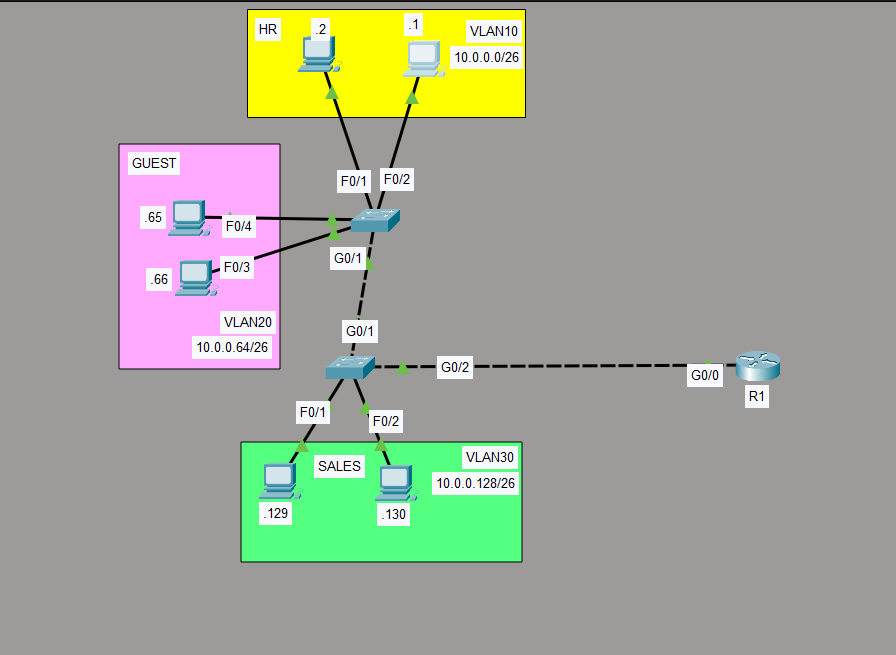

### 02: Switching & VLANs 🌐

This folder contains a hands-on lab demonstrating network segmentation using VLANs and Inter-VLAN routing across multiple switches.

📍 **Topology Diagram**

### 📄 Lab Documentation
* **Packet Tracer File:** [InterVlan-Lab.pkt](InterVlan-Lab.pkt)
* **Verification Logs:** [R1-SW1-Verification.txt](R1-SW1-Verification.txt)

### 🛠️ Config Highlights:
* **Router-on-a-Stick:** Configured R1 with sub-interfaces (G0/0.10, G0/0.20, G0/0.30) to act as the gateway for all departments.
* **VLAN Segmentation:** Created VLAN 10 (HR), VLAN 20 (GUEST), and VLAN 30 (SALES) to isolate broadcast domains.
* **Trunking:** Configured IEEE 802.1Q trunking between switches and the router to carry multi-VLAN traffic.
* **Transit VLANs:** Successfully passed VLAN 10/20 traffic through SW2 to reach the router gateway.
